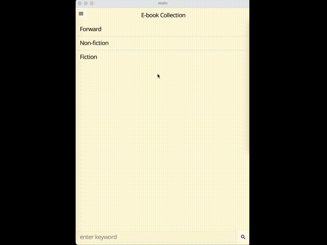
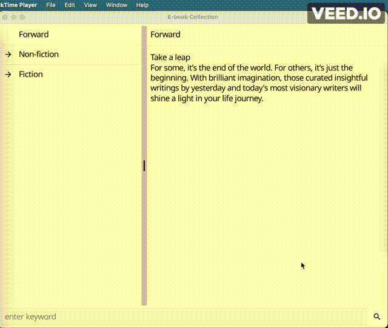
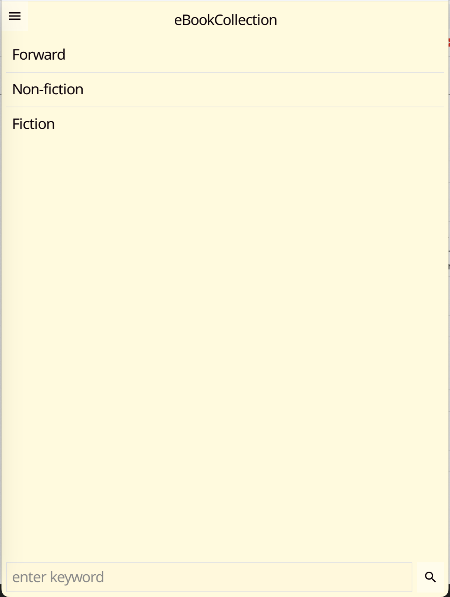
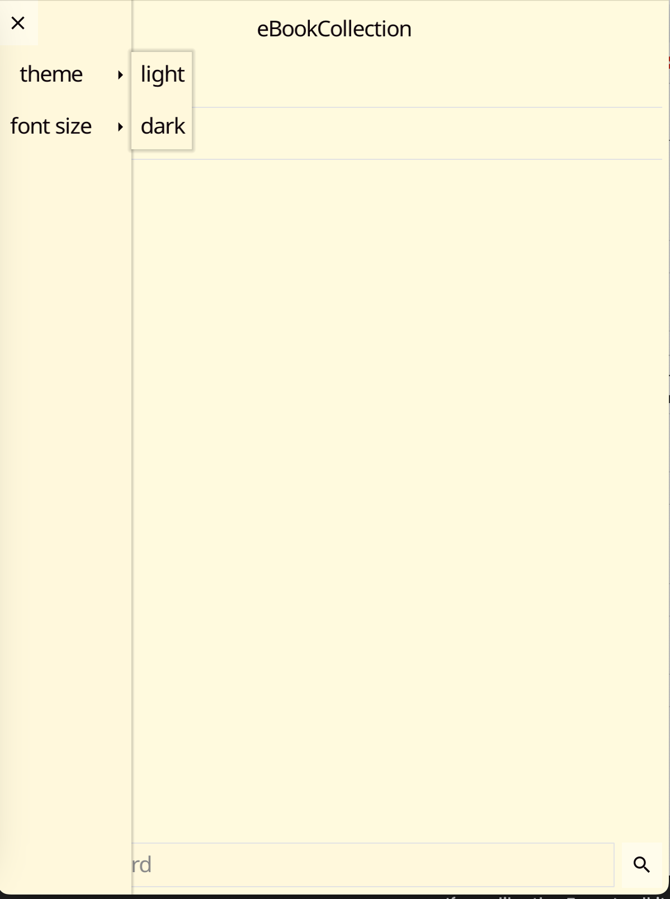
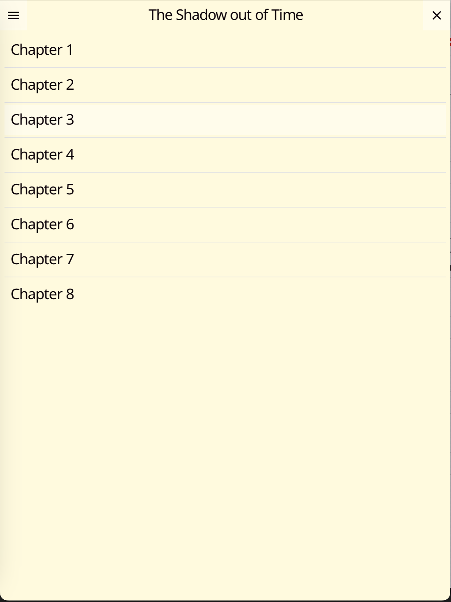
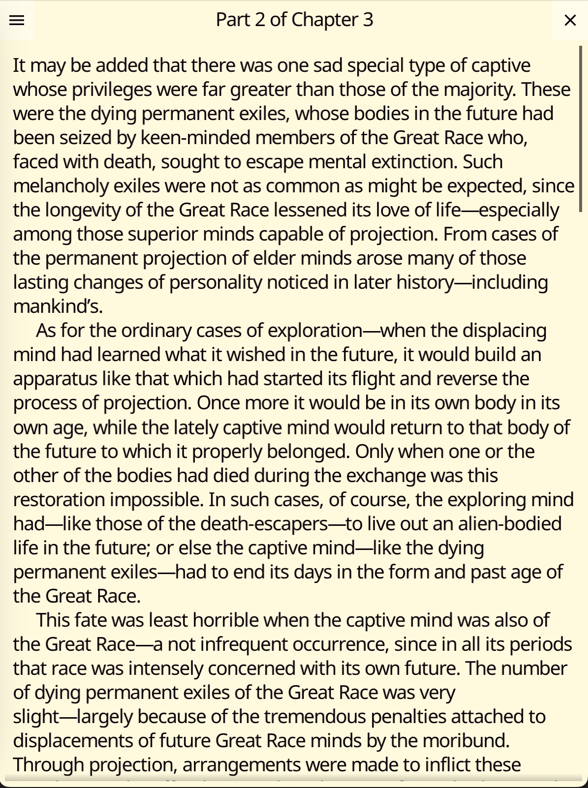
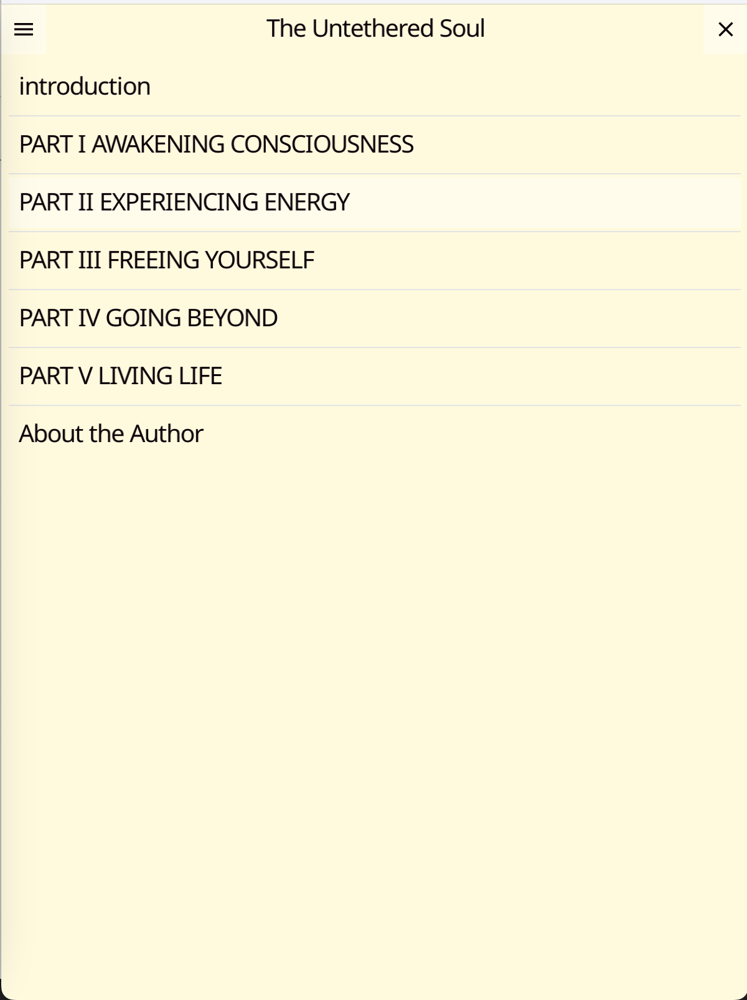

# eBook-App-Fyne

## Description

This project is a cross platform ebook application made in Fyne toolkit. It can be run in mobile and desktop. The app has some books pre-installed, now it contains non-fiction and fiction books, of course book categories can be changed and user can add or remove books by modifying `internal/articles/assets/articles_index.json` file and add or remove text files that contains the book text to `internal/articles/assets` folder. A later step in the tutorial will explain how to add more books.

## Run the program

Some instructions are in Fyne's web link: https://developer.fyne.io/started/

Besides Go is required in the system, you need to download the Fyne module and helper tool, and the following commands are needed

```
$ go get fyne.io/fyne/v2@latest
$ go install fyne.io/fyne/v2/cmd/fyne@latest
$ go run .
or
$ go run -tags mobile main.go
```

`go run .` is for desktop version <br>
`go run -tags mobile main.go` is to simulate a mobile application

## Package the desktop version

Instruction is in this link: https://developer.fyne.io/started/packaging

go install fyne.io/fyne/v2/cmd/fyne@latest

- for macOS

```
fyne package -os darwin -icon myapp.png
```

- for linux and window version

```
fyne package -os linux -icon myapp.png
fyne package -os windows -icon myapp.png
```

### Package the mobile version

Instruction link: https://developer.fyne.io/started/mobile
For Android builds, you must have the Android SDK and NDK installed
For iOS build, you will need Xcode installed on your macOS computer as well as the command line tools optional package.

build commands for android and ios is as follows:

```
fyne package -os android -appID com.example.myapp -icon mobileIcon.png
fyne package -os ios -appID com.example.myapp -icon mobileIcon.png
```

### About articles_index.json file and how to add more books to the app

A book may fall into a category and consists of a number of chapters. The text in each chapter should be saved in a text file or multiple files under `internal/articles/assets` directory. The json structure in `internal/articles/assets/articles_index.json` file explain the Hierarchy of categories and books.

For example:

```
 "key": "bookKeyValue",
 "title": "book Title",
 "tableOfContents": [
    {
        "key":"chapter1Key",
        "title": "chapter 1 title"
    },
    {
        "key":"chapter2Key",
        "title": "chapter 2 title"
    },
 ]
```

The json object in the `articles_index.json` file has the structure of `{key, title, TableOfContents}`. An object can represent a category, a book or a chapter in a book. A key's value must be unique for each object.

If there is a `tableOfContents` key in a json object, it means the object depicts a category or a book that contains some content which could be some chapters for a book, or books for a categories stored in the `tableOfContents`.

If there is no `tableOfContents` key in a json object, then the json object's structure is `{key, title}`, so this json object normally is a chapter in a book, and the text is saved a file. For instance, if key's value is `chapter2Key`, the file `chapter2Key.txt` that contains the content of the chapter should be saved under `internal/articles/assets` folder.

If a user wants to add more books, he or she just adds a json object for the book to the corresponding category object's `tableOfContents` value, vice versa when user wants to remove an e-book, the user can delete the json object from `tableOfContents` value. The same rule applies to adding and removing the categories and chapter etc.

## demo

- mobile version



- desktop version



## app screenshots







